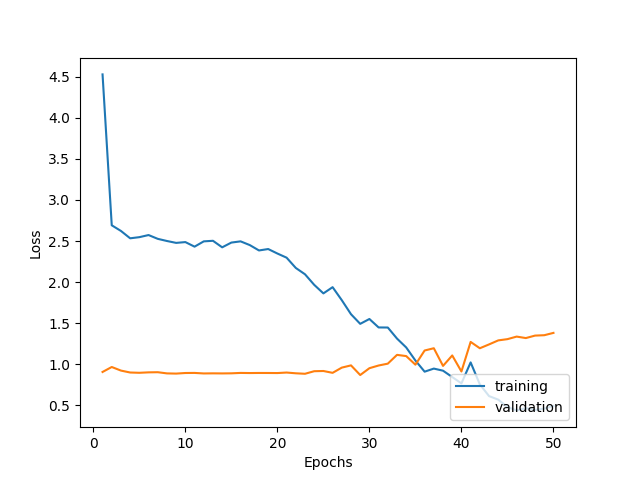

# Documentation
### Documentation for Visual Memory independent study with Prof. Chris Heckman.
#### The aim of this Independent Studies was to

- Get familiar with ROS and PyTorch. ✅
- Explore [Gibson Simulator](http://gibsonenv.stanford.edu/) with ROS. **(Partially done)**
- Create an *end-to-end* deep neural network with Convolutional Neural Network (CNN) as feature extractor and Long Short-Term Memory (LSTM) for learning optimal policy just based on visual data and no prior mapping of the environment. ✅
- Gather training data using Gibson or an actual robot (Movo in our case). ✅

## Problem statement

We wanted to replicate this [paper](https://papers.nips.cc/paper/7357-visual-memory-for-robust-path-following) and add additional input modalities to see if we can improve upon the results.
Briefly, we want to learn a discrete action policy based on the current image/depth along a path in order to retrace the path.

#### Network Architecture I used
```
LSTM(
  (embedding): CNN(
    (pool): MaxPool2d(kernel_size=2, stride=2, padding=0, dilation=1, ceil_mode=False)
    (conv1): Conv2d(3, 10, kernel_size=(5, 5), stride=(1, 1))
    (conv2): Conv2d(10, 20, kernel_size=(5, 5), stride=(1, 1))
    (fc1): Linear(in_features=7020, out_features=1000, bias=True)
    (fc2): Linear(in_features=1000, out_features=500, bias=True)
  )
  (lstm): LSTM(500, 100, batch_first=True)
  (hidden_to_tag): Linear(in_features=100, out_features=3, bias=True)
)
```
The forward propagation for the CNN feature extractor is through 

`MaxPool -> MaxPool -> MaxPool -> Convolution -> ReLU -> MaxPool -> Convolution -> ReLU -> MaxPool -> FC1 -> ReLU -> FC2`

I used a few `MaxPool`s in the beginning to downsample the input image

The output of this is passed through

`LSTM -> Linear`

And this whole network is trained end-to-end using `cross-entrophy` loss or equivalently if we have `LSTM -> Linear -> log Softmax` then `Negative Log Liklihood` using `Adam` optimizer.

[Link to CNN used for RGB data](cnn_model.py)

[Link to end-to-end network for RGB data](end_to_end_model.py)

[Link to CNN used for Depth data](cnn_model_depth.py)

[Link to end-to-end network for Depth data](end_to_end_model_depth.py)


#### Action space

I have considered only three actions currently - *left (by 30 degrees), right* and *forward.*

#### Dataset

- I collected **290 (image, action)** and **290 (depth, action)** tuples.
- I considered a path to be made up of **10 actions**, this gave me 29 paths in the dataset.
- Data can be downloaded from the following link.
##### Note: You should be associated with CU to be able to download this.

https://drive.google.com/open?id=1e0djz-Ia5a0wIniFtpn9r-0WVpb65w_h

- If you want to collect your own data, I have created a [documentation](movo_data_collection.md) for that as well.


#### Results

With `50 epochs` and a `0.64, 0.2, 0.16 (train, validation, test)` split. Here's is training loss and validation loss plot.



- We see that the training loss falls quickly but the validation loss remains almost constant and soon we overfit after close to 35 epochs.
- The accuracy remains in the range of 80-95% for most runs but the results are underwhelming since the **data is heavily skewed** to contain mostly `forward` action.
- For example - 
    **Ground truth** action labels for a single path - **[ 0,  0,  0,  0,  1,  1,  0,  1,  0,  0]**
    **Predicted** action labels for the same - **[ 0,  0,  0,  0,  0,  0,  0,  0,  0,  0]**
    
    We can see that the model failed to predict a `left` action there a few times.
    
#### Future work and improvements

The paper we roughly followed used `attention` and used an `input path` which it intends to retrace. 

We need to try this encoder-decoder architecture with attention to improve the results.


#### Credits

My code is inspired from this [PyTorch class](https://www.udacity.com/course/deep-learning-pytorch--ud188) on Udacity.


